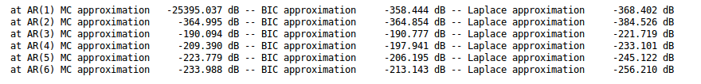

# Hypothesis testing with Bayesian AR(p) models
This project focuses on hypothesis testing. In particular, we test how many Auto Regressive (AR) coefficients are necessary to represent a time series. We will dive into the hypothesis testing as proposed in "Probability theory: the logic of science" by E.T. Jaynes. Jaynes gives us a logically consistent way to test hypotheses. In finding the order of a AR process, each order, , will represent a hypothesis. The hypothesis test from Jaynes book will tell us for which hypothesis we have most evidence.

# Hypothesis testing
For Jaynes, all inferences in probability theory stem from the product and sum rule. For those who want to go deeper, Jaynes even derivates these rules from three elementary axioms. Here, we are interested in the probability of a hypothesis to be true. We find this probability of the hypothesis using the observed data and the prior assumptions we make. Let the data be  and our background information be , then the product rule follows:

In the case, we compare two hypotheses against eachother, then the odds of one hypothesis over another is:

Jaynes likes to express probability ratios in decibels. So our equation follows to:

We give all hypotheses equal prior probability. Therefore, we will focus in the evidence terms: 

# Our Auto Regressive model
We set out to find the order of auto regressive coefficients to represent our time series. Finding this order is usefull for filtering or prediction of stationary signals. One example could be to predict the next time step in stock or pricing series.

The model for timestep,  in a time series is:

where 

## Probability of the data
From our model, we write down the likelihood of the parameters: (from here on, we will take the conditioning on background  implicit)

p(y_t|\alpha H) = \mathcal{N}(\sum_{i=0}^{p-1} \alpha_i y_{t-i}, \sigma^2)

Or, lumping it all together: (for simplicity, we allow for negative indices in )

# Approximations to the marginal likelihood
Now we are stuck. In the final equation, we wrote down the probability of the data. However, we use a parameter to produce this probability. To answer our hypothesis test, we look for the probability of the data, conditioned only on the hypothesis: . We also name this probability  sometimes the marginal likelihood.

As the name suggests, we can find out marginal likelihood by marginalising the likelihood:

For this marginalisation, we discuss three approximations:

  * Monte Carlo approximation: approximate the integral with samples from 
  * Laplace approximation: approximate the integral with a Laplace approximation around the Maximum A Posteriori (MAP) value for 
  * Bayesian Information criterion: approximate the integral with the MAP value plus a penalty term for the free parameters that were fitted

## Monte Carlo approximation
Instead of evaluating the integral, we may rewrite is as:

We approximate the expectation with the Monte Carlo estimate:

## Laplace approximation
In the Laplace approximation, we fit a Gaussian distribution around the maximum, like so:

p(y|H) =  \int_\alpha  p(y|H\alpha) p(\alpha|H)\delta \alpha = p(y|\alpha_{MAP}H)p(\alpha_{MAP}|H)(\det A \frac{1}{2\pi})^{-\frac{1}{2}}

We approximate the intergrand with a Gaussian, because can integrate the Gaussian analytically.

## Bayesian Information Criterion
In the final approximation, we don't use a property of the integral, but penalize complexity of our model explicitly.

That is, we approximate the marginal likelihood like:
p(y|H) \simeq p(y|H \alpha_{MAP}) - \frac{\text{dof}}{2} \log (N)

Here the  indicates the _degrees of freedom_ in the model. In our case, the degrees of freedom equals the number of AR coefficients

# Results
In the code, we implement all three approximations. Below we show the table that rolls out:

Two observations:

  * First, the numerical values do not equal for the various approximations. After all, we make approximations.
  * Second, the highest marginal likelihood occurs at AR(3) for all three approximations. Fortunately, because we used an AR(3) to generate our data!

# Further reading

  * [Probability theory by E.T. Jaynes ](https://www.cambridge.org/core/books/probability-theory/9CA08E224FF30123304E6D8935CF1A99)
  * [On auto regressive models](https://www.pearson.com/us/higher-education/program/Kay-Fundamentals-of-Statistical-Processing-Volume-I-Estimation-Theory/PGM50476.html)
  * [Chapter 28 on Model comparison of Mackay's Information theory, inference and learning algorithms.](http://www.inference.org.uk/itila/book.html)

